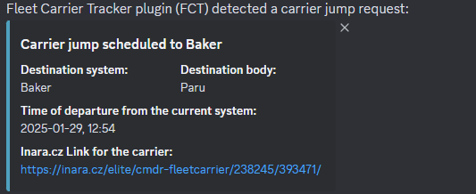
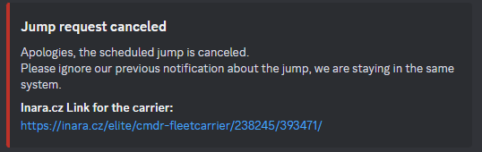

# Fleet Carrier Tracker (EDMC plugin)

### What is this:
A plugin for [EDMC](https://github.com/EDCD/EDMarketConnector) (Elite: Dangerous Market Connector) to notify a discord text-channel about upcoming Carrier jumps.
The plugin watches your journey file and send a discord text message via webhook in the moment when the carrier's owner (you) setup or cancel a jump.

### Who is for:

- This plugin is for Fleet Carrier Owners Only.
- This plugin only support ONE carrier at the moment

### Requirements: 

[Elite: Dangerous](https://www.elitedangerous.com/) + **A Fleet Carrier**

[Elite: Dangerous Market Connector (EDMC)](https://github.com/EDCD/EDMarketConnector)

[Discord](https://discord.com/) - with access to a server where you can set up a webhook, or get a link to a webhook from the server admins.

### Features: 

- [ ] Discord notifications:
  - [x] Jump Request notification
  - [x] Jump Cancelled notification
  - [x] [Inara](https://inara.cz/elite/news/) Link for your carrier
  - [ ] [Inara](https://inara.cz/elite/news/) link for the system
  - [ ] Calculated lockdown time
- [ ] FCT Settings
  - [x] Discord webhook link
  - [x] [Inara](https://inara.cz/elite/news/) link
    - [ ] optional link
  - [ ] Optional Dashboard display
- [ ] EDMC dashboard
  - [ ] Current system with [Inara](https://inara.cz/elite/news/) link
  - [ ] Carrier Name + link to [Inara](https://inara.cz/elite/news/)
  - [ ] Track time/countdown
    - [ ] Time until Lockdown time
    - [ ] Time until jump
    - [ ] Time left to cancel the jump

### How to install it?

1. Download the latest version from here: --- LINK will be available at v1.0 --- 
2. Extract the folder to the EDMC's plugin folder
3. Restart EDMC
4. Open Settings 
5. FleetCarrierTracker Tab
6. Copy/Paste your Discord webhook and [Inara](https://inara.cz/elite/news/) links
7. Press ok 

#### More detail about:

> Plugin installation to EDMC please read this:
>
> https://github.com/EDCD/EDMarketConnector/wiki/Plugins

> What is and how to create a Discord webhook:
> 
> https://support.discord.com/hc/en-us/articles/228383668-Intro-to-Webhooks

