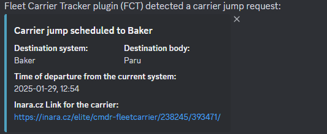
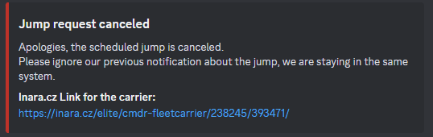

# Fleet Carrier Tracker (EDMC plugin)

### What is this:
A plugin for [EDMC](https://github.com/EDCD/EDMarketConnector) (Elite: Dangerous Market Connector) to notify a discord text-channel about upcoming Carrier jumps.
The plugin watches your journey file and send a discord text message via webhook in realtime when the carrier's owner (you) setup or cancel a jump.

### Who is for:

- This plugin is for Fleet Carrier Owners Only.
- This plugin only support ONE carrier at the moment

### Requirements: 

[Elite: Dangerous](https://www.elitedangerous.com/) + **A Fleet Carrier**

[Elite: Dangerous Market Connector (EDMC)](https://github.com/EDCD/EDMarketConnector)

[Discord](https://discord.com/) - with access to a server where you can set up a webhook, or get a link to a webhook from the server admins.

[Inara](https://inara.cz/elite/news/) account *this will be optional later

### Features/todo: 

- [x] Discord notifications:
  - [x] Jump Request notification
  - [x] Jump Cancelled notification
  - [x] Inara Link for your carrier (optional)
  - [x] Inara link for the system
  - [x] Markdown code field for easy copy to system and body
  - [x] Calculated lockdown time
- [ ] FCT Settings
  - [x] Discord webhook url input
  - [x] Discord message tester
  - [x] Inara url input
    - [x] optional link
  - [ ] Optional Dashboard display
  - [ ] Discord url pattern verification
  - [ ] inara url pattern verification
- [ ] EDMC dashboard
  - [ ] Current system with Inara link
  - [ ] Carrier Name + link to Inara
  - [x] Track time/countdown
    - [x] Time until Lockdown time
    - [x] Time until jump
    - [ ] Time left to cancel the jump

### How to install it?

1. Download the latest version from here: https://github.com/gaboreszaki/FleetCarrierTracker/releases
2. Extract the folder to the EDMC's plugin folder
3. Restart EDMC if you had it open
4. Open Settings 
5. FleetCarrierTracker Tab
6. Copy/Paste your Discord webhook and Inara links to the input fields
   - Optionally you can test your Discord link with the **Send TEST message** button
7. Press ok to save your settings

### Development mode:
To not use a live notification chanel but use a development channel, set the `fct_is_dev_mode` variable to `TRUE`
and add a new registry entry to `Computer\HKEY_CURRENT_USER\SOFTWARE\Marginal\EDMarketConnector` with the name `fct_dev_webhook_url`
add your desired webhook url as a value, then start/restart EDMC to load new parameters. 

### Examples of the sent messages

#### More detail about:

> Plugin installation to EDMC please read this:
>
> https://github.com/EDCD/EDMarketConnector/wiki/Plugins

> What is and how to create a Discord webhook:
> 
> https://support.discord.com/hc/en-us/articles/228383668-Intro-to-Webhooks
> 

